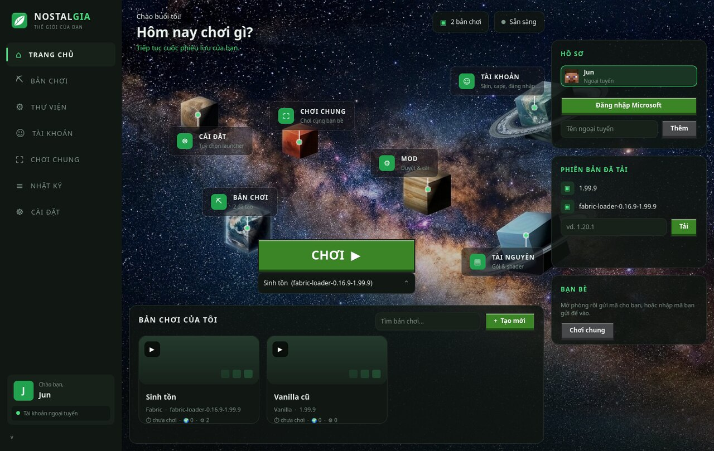
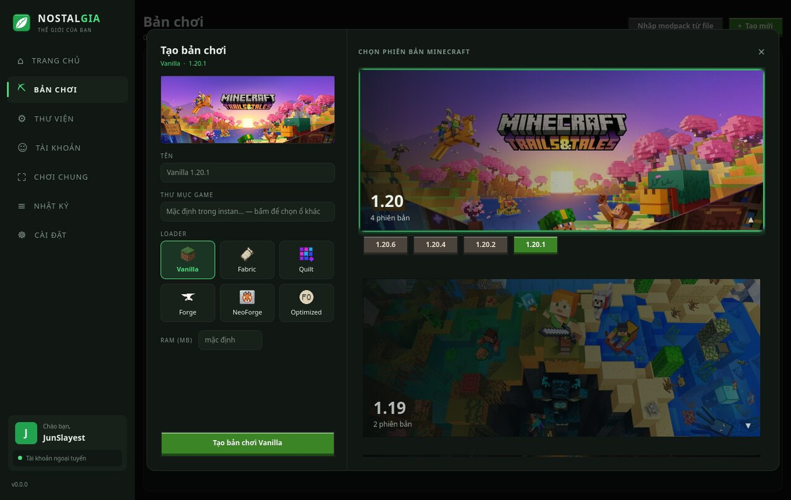
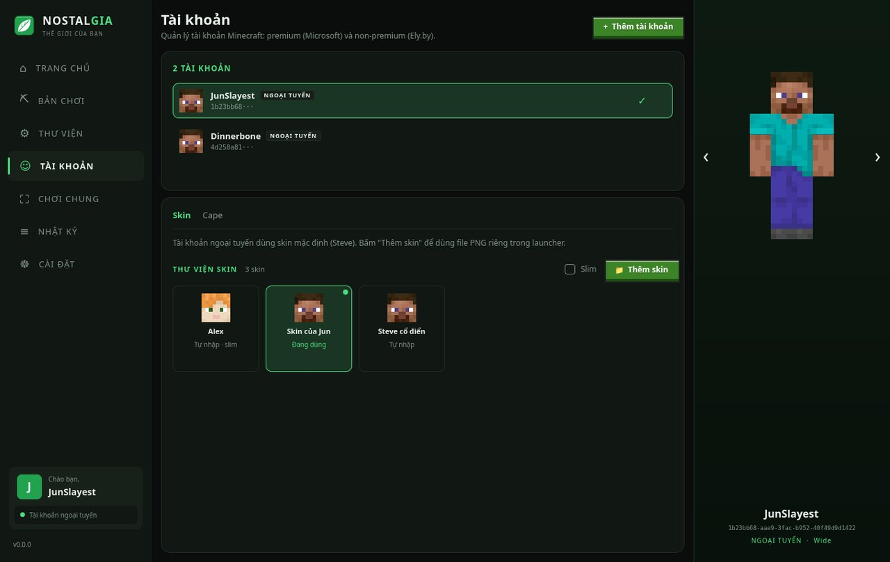
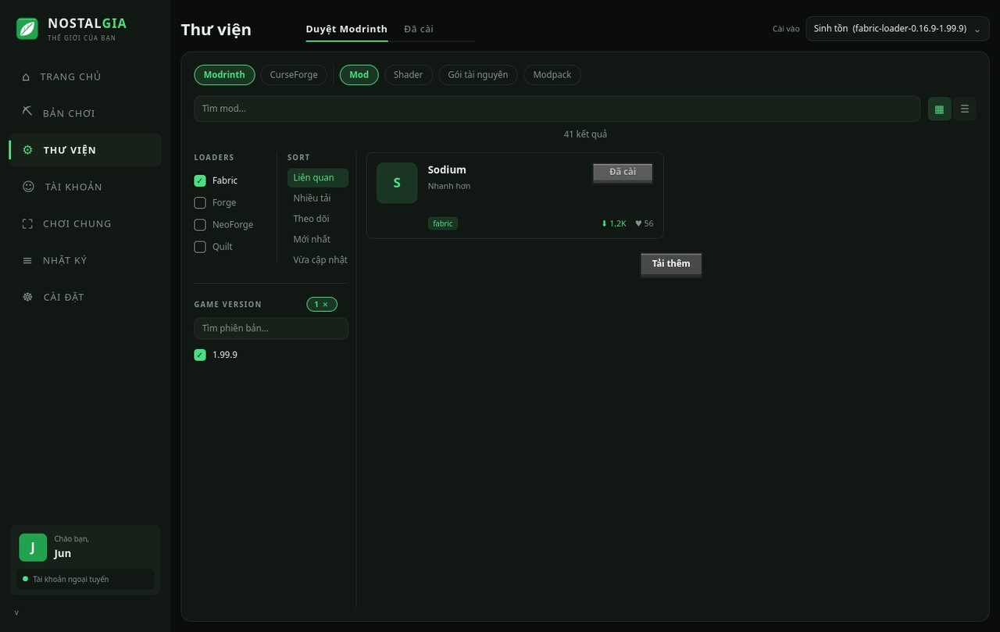
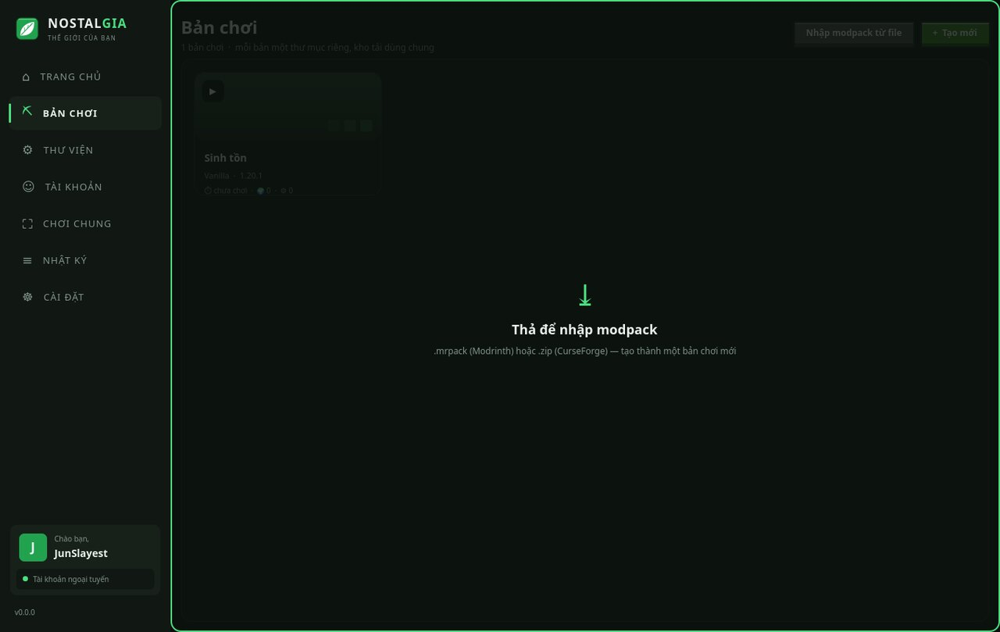
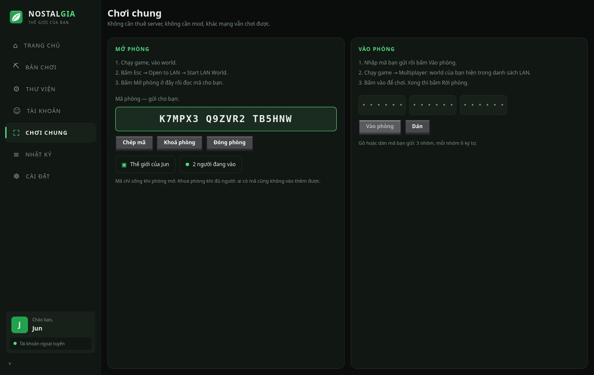
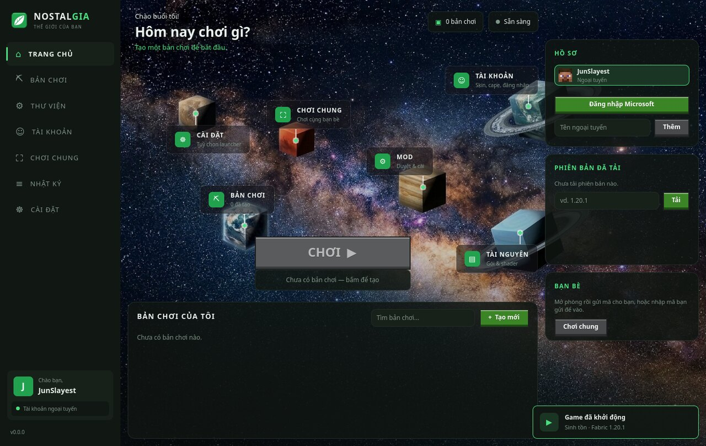
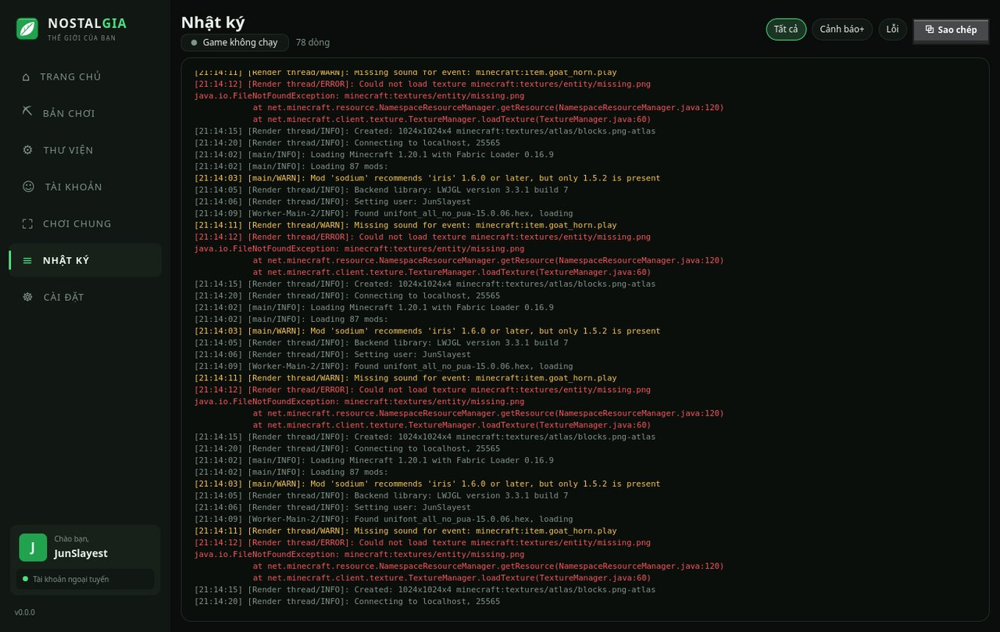
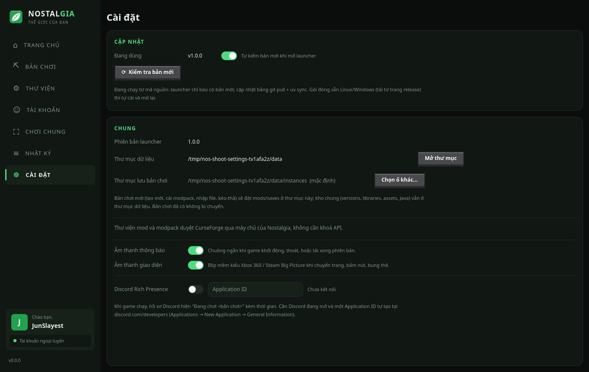

<div align="center">


# Nostalgia Launcher

### A Minecraft launcher rebuilt from zero — for the feeling of coming home.

Sign in, pick a version, press **CHƠI**. Everything else — Java, loaders, mods, modpacks,
skins, friends, updates — is already taken care of.




**[⬇️ Download the latest release](https://github.com/JunXmas/NostalgiaLauncher/releases/latest)**

</div>

---

## Why this exists

I built my first Minecraft launcher in August 2026. It was my very first real project, and I
loved it — the frosted Aero glass, the little home screen, the feeling that opening a program
could be a tiny event again. People were kind about it. It also had rough edges everywhere,
because I was learning while I typed.

So I did the scary thing: **I started over.** Same name, same heart, none of the old code.

This repository is that second attempt. It was written step by step, one pull request at a
time, with a rule I did not have the first time: *nothing ships without a test that proves it.*
The launcher you see in the screenshots is the result — 130 commits, 770 tests, and a lot of
evenings. It is not finished (a launcher never is), but for the first time I am not afraid of
what is underneath the paint.

Welcome back. Nostalgia is the point. 💚

---

## A look inside

### 🏠 Home — "What are we playing today?"


The home page is a night sky over a Minecraft world, with little floating cards pinned to the
landmarks in the picture — a planet for **Accounts**, a redstone block for **Mods**, a cabin
for **Instances**. Hover one and it lifts; the pin under it breathes for a second and settles.
The big green **CHƠI ▶** button is a real block: it lifts on hover and sinks with a little
weight when you press it. On the right, your profile, the version you last played, and the
friends who are online right now.

### ⛏ Create an instance — every version has a face



Every Minecraft generation is a card with its official key art (Trails & Tales, The Wild
Update, Caves & Cliffs…). Cards you haven't picked sit dimmed in their slots; tap one and it
**lights up, glows, and lifts out of the slot** while its versions slide down as stone buttons.
Pick a loader — Vanilla, Fabric, Quilt, Forge, NeoForge, or *Optimized* (a ready-made
Fabulously Optimized pack for the best FPS) — choose RAM, and if your main drive is full,
point that one instance at **any folder on any disk**.

### 👤 Accounts and a skin library that lives in the launcher



Microsoft, [Ely.by](https://ely.by) and offline accounts side by side, with a proper full-body
preview you can turn around. Every skin the launcher ever meets — downloaded for an account,
uploaded, or added by you — lands in the **skin library**. One button, *Thêm skin*, does the
right thing for whoever is selected: Microsoft accounts upload to Mojang, everyone else gets
the skin applied instantly. Ely.by accounts go through authlib-injector, and the injector jar is
verified by SHA-256 before it is ever handed to Java.

### 📚 Library — Modrinth and CurseForge, no API key



Mods, resource packs, shaders and modpacks from **Modrinth** and **CurseForge**, filtered by the
loader and version of the instance you are installing into. CurseForge requests go through the
project's own tiny relay so you never have to create or paste an API key. Drop a `.mrpack` or
`.zip` anywhere on the window and it becomes an instance.



### ⛶ Play together — LAN over the internet



Open a LAN world, press **Mở phòng**, and read your friend an 18-character room code. They
paste it, and their game sees your world as if you were on the same Wi-Fi. The relay only ever
forwards bytes; it cannot read your world. The ten security rules it lives by — and the tests
that enforce every one of them — are in [`docs/MULTIPLAYER_SECURITY.md`](docs/MULTIPLAYER_SECURITY.md).

### 🔔 It tells you what is happening



A quiet toast when the game starts, when it exits, when a version finishes downloading, when an
update is ready — with a short chime you can switch off. Soft dashboard-style interface sounds
(navigation blip, select, open, back) have their own switch and were tuned to stay well below
the frequencies that give you a headache.

### 📜 Log and statistics



The game's output streams into the **Nhật ký** page live, capped at 5,000 lines, with a
warning/error filter and one-click copy for bug reports. Every instance keeps its own numbers:
hours played, launches, worlds, mods.

### ⚙ Settings, auto-update, Discord



Auto-update checks GitHub once at startup (switchable), downloads over HTTPS, verifies the
`SHA256SUMS` of the release, and only ever applies itself to a packaged build — never to a
source checkout. Discord Rich Presence is off by default and uses an Application ID you create
yourself. A default folder for new instances lets you keep the whole library on a second drive.

---

## What's new in the rework

Everything below did not exist in the old `NostalgiaLauncher`, or was rebuilt from the ground up:

- 🔐 **Ely.by accounts** next to Microsoft and offline — with the authlib-injector jar verified by SHA-256 before Java ever sees it.
- 🧱 **Quilt** and an **Optimized** preset join Vanilla / Fabric / Forge / NeoForge.
- 💽 **Any instance on any disk** — point a modpack at a second drive when the main one is full.
- 🖼 **Key-art version cards** that dim, glow, lift and slide open.
- 🛒 **CurseForge without an API key**, plus Modrinth, plus **drag-and-drop** modpack import.
- 🌐 **Play together over the internet** with a room code — no port forwarding, no plugins.
- 🎨 **Skin library** inside the launcher, one button to add / upload / apply.
- 📜 Live **game log** with filters, **play statistics**, toasts, chimes, **dashboard-style UI sounds**, **Discord Rich Presence**.
- 🔄 **Auto-update** that refuses anything without a matching `SHA256SUMS`.
- 📦 **Installers for everyone**: AppImage / .deb / .rpm / tar.gz on Linux, .dmg for Apple Silicon and Intel, a proper setup.exe on Windows.
- 🧪 Under the hood: 770 tests, zero-dependency core, seven fenced layers, 200-line files, a naming glossary — all enforced by CI.

---

## Get it

**Packaged** — pick your platform on the
[Releases page](https://github.com/JunXmas/NostalgiaLauncher/releases/latest). Every file is
built by GitHub Actions from a tagged commit, smoke-tested on that OS, and listed in `SHA256SUMS`.

| Platform | File |
|---|---|
| Linux, any distro (glibc ≥ 2.35) | `nostalgia-<ver>-linux-x64.AppImage` — `chmod +x`, run |
| Debian / Ubuntu / Mint / Pop!_OS | `nostalgia_<ver>_amd64.deb` — `sudo apt install ./…deb` |
| Fedora / openSUSE / RHEL / Nobara | `nostalgia-<ver>-1.x86_64.rpm` — `sudo dnf install ./…rpm` |
| Linux, portable | `nostalgia-<ver>-linux-x64.tar.gz` or `.zip` |
| macOS Apple Silicon | `nostalgia-<ver>-macos-arm64.dmg` — drag to Applications |
| macOS Intel | `nostalgia-<ver>-macos-x64.dmg` |
| Windows 10/11 | `nostalgia-<ver>-windows-x64-setup.exe` — no admin needed |
| Windows, portable | `nostalgia-<ver>-windows-x64.zip` |

The builds are not code-signed yet: macOS asks you to right-click → *Open* the first time, and
Windows SmartScreen wants *More info → Run anyway*. Linux and Windows packages update themselves
in place; on macOS the launcher tells you when a new `.dmg` is ready.

**From source** — needs Python 3.12+ and [uv](https://docs.astral.sh/uv/):

```sh
git clone https://github.com/JunXmas/NostalgiaLauncher.git
cd NostalgiaLauncher
uv sync --extra ui
uv run nostalgia-ui
```

The core also works without a window at all:

```sh
uv run nostalgia account add-offline Jun
uv run nostalgia install 1.20.1
uv run nostalgia instance create vui-ve --version 1.20.1
uv run nostalgia play vui-ve --account Jun
```

> The interface currently speaks **Vietnamese**. English is on the list.

---

## The rework, honestly

| | Old `NostalgiaLauncher` (Aug 2026) | This repository (1.0, Sep 2026) |
|---|---|---|
| Codebase | one big Qt app, learned as I went | rewritten from an empty folder |
| Runtime dependencies | `PySide6`, `requests` | **none** for the core; `PySide6-Essentials` only if you want the window |
| Tests | a handful | **770**, run on Python 3.12 and 3.13 in CI |
| Architecture | everything talks to everything | 7 layers; a test fails if a lower layer imports a higher one |
| UI ↔ engine | direct calls | one façade (`nostalgia.api`) — the UI cannot import anything else |
| File size | some files > 1,000 lines | every `.py` ≤ 200 lines of code, enforced by a test |
| Naming | whatever came to mind | a glossary of banned/required names, enforced by a test |
| Accounts | Microsoft, offline | Microsoft, **Ely.by**, offline |
| Loaders | Vanilla, Fabric, Forge, NeoForge | + Quilt, + Optimized preset |
| Multiplayer | — | LAN over relay with room codes |
| Skins | pixel editor, 3D model | library, upload, apply; editor is coming back |
| Languages | 10 | Vietnamese (for now) |
| Builds | .exe / .dmg / .deb | Linux and Windows zips with checksums; macOS pending |

What I kept: the name, the warm home screen, the idea that a launcher should do the boring parts
for you. What I gave up, for now: the pixel skin editor, translations, and the macOS build. They
will return — but this time on top of something that does not fall over.

---

## Under the hood

- **Zero-dependency core.** Downloads, Microsoft/Ely.by auth, version manifests, natives,
  Java runtimes, modloader installers — all on `http.client` and the standard library. It is
  1.5× faster than `requests` under parallel downloads and starts faster, too
  ([`docs/PERFORMANCE.md`](docs/PERFORMANCE.md)).
- **Seven layers with a fence.** `tests/test_api_boundary.py` and friends fail the build if the
  UI imports anything but the façade, if a file grows past 200 lines, or if a banned name
  ([`GLOSSARY.md`](GLOSSARY.md)) sneaks in.
- **Security first.** Path traversal checks on every archive entry, SHA-256 on every downloaded
  jar and on every update, a network guard in the test suite so no test can touch the internet
  by accident, and a relay that cannot see inside your world.
- **Measured, not guessed.** `bench/` holds real probes — how many disk reads a click costs, how
  long the UI thread stalls when you expand a card (it used to be 200 ms; it is now under 1 ms).

Contributing notes live in [`CONTRIBUTING.md`](CONTRIBUTING.md); releases in
[`docs/RELEASE.md`](docs/RELEASE.md).

---

## Tiếng Việt

Nostalgia Launcher là trình khởi động Minecraft viết lại từ đầu sau dự án đầu tay cùng tên
(08/2026). Đăng nhập Microsoft / Ely.by / ngoại tuyến, tạo bản chơi theo dòng phiên bản với key
art chính thức, loader Vanilla / Fabric / Quilt / Forge / NeoForge / Optimized, thư viện mod và
modpack từ Modrinth và CurseForge (không cần khoá API), chơi chung qua relay bằng mã phòng, thư
viện skin, nhật ký game, thống kê, thông báo, tự cập nhật có kiểm sha256. Lõi không phụ thuộc
thư viện ngoài; 770 test; mỗi file ≤ 200 dòng. Chi tiết từng bản ở [`CHANGELOG.md`](CHANGELOG.md).

---

## License

**GPL-3.0.** You may use, study, change and share this launcher freely — and if you distribute a
modified version, it must stay open under the same license. That is on purpose: this project
should never end up as the closed part of someone else's product.

Minecraft is a trademark of Mojang Studios / Microsoft. The key art in
`src/nostalgia/ui/qml/assets/keyart/` belongs to Mojang and is used for non-commercial
illustration only ([credits](src/nostalgia/ui/qml/assets/keyart/CREDITS.md)). This launcher is
not affiliated with Mojang or Microsoft.
