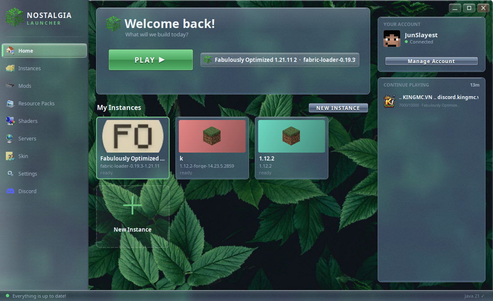
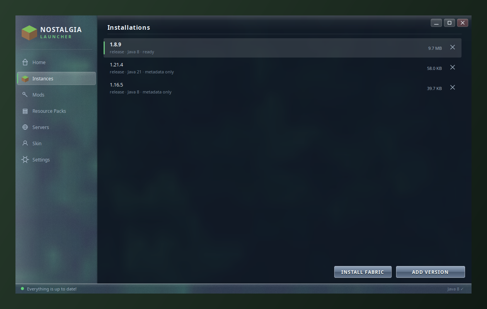
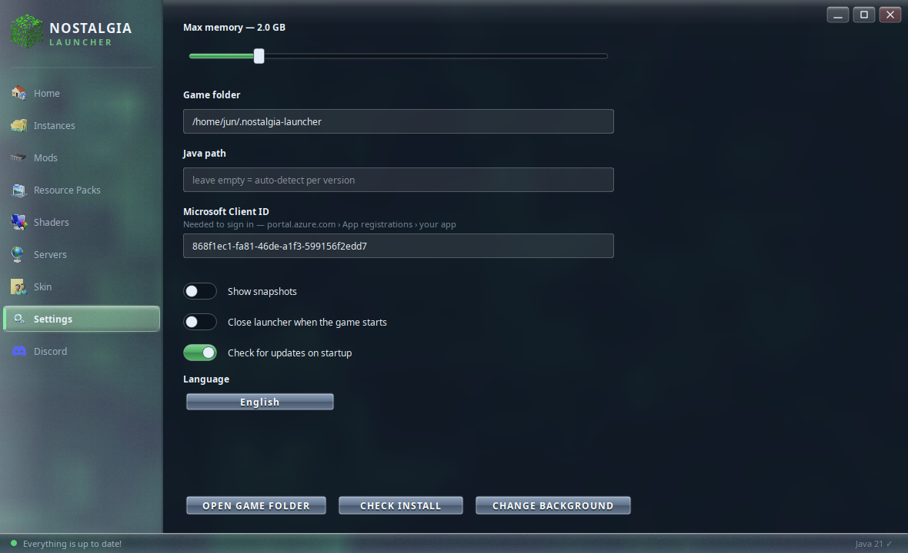

<div align="center">

# 🪟 Nostalgia Launcher

### A Minecraft launcher that feels like Windows 7 again.

Frosted Aero glass, a warm little dashboard, and everything that should just work — built from scratch in Python.


-41CD52?logo=qt&logoColor=white)




</div>

---

## Hey 👋

This is my **very first real project**. I grew up with the glossy, glassy look of Windows 7 —
and I missed it. So I tried to bring that feeling back to something I use every day: a Minecraft
launcher. Every panel here is real frosted glass, hand-drawn pixel by pixel, sitting over a
background you can swap for anything you like.

It's still a work in progress, so you might hit a rough edge here and there. But it already does
the important things well, and I'd love for you to try it. Thanks for stopping by 💙

## Why you might like it

- 🪟 **It actually looks like Aero.** Not a flat "glassmorphism" rectangle — the real recipe:
  a blurred backdrop, an exclusion-blend for depth, a blue tint, fine acrylic noise, and a glossy
  top sheen. Buttons even *sink* with a little weight when you press them.
- 🎮 **Vanilla and Fabric, one click each.** Pick any version, or drop on a Fabric loader without
  hunting through files.
- ☕ **You never install Java.** It quietly downloads the exact Java each version needs and keeps it
  tidy in its own folder.
- 👤 **Sign in once, switch freely.** Add your Microsoft account (or several), and jump between them
  without logging in again. Don't own the game yet? It runs the official Demo automatically.
- 📰 **Real news & patch notes**, straight from Mojang, right on the home screen.
- 🖼️ **Make it yours.** Any image can be your background — there's a button for it in Settings.
- 🧪 **A little doctor.** One click tells you exactly what's missing before you ever launch —
  no cryptic Java stack traces.

## A look inside

| Home | Instances | Settings |
|:---:|:---:|:---:|
|  |  |  |

## Try it

Run from source, on any of the three platforms:

```bash
pip install -r requirements.txt      # PySide6 + requests
python -m nostalgia gui
```

Prefer a real installer? Windows gets a `.exe` setup, macOS a `.dmg` — both are built by
GitHub Actions and land in the Releases page. See [docs/PACKAGING.md](docs/PACKAGING.md) to build
them yourself. They aren't code-signed yet, so the first launch needs one click past the OS warning;
that page explains exactly which one.

Command line works too, if that's your thing:

```bash
python -m nostalgia fabric 1.21.4     # install Fabric
python -m nostalgia jre 1.21.4        # pre-fetch Java
python -m nostalgia doctor 1.21.4     # health-check an install
```

Signing in with Microsoft is friendlier than it used to be: the app simply **asks for your Azure
Application (client) ID the first time** — paste it once, it's saved, and you're in. Making one is
free and takes a minute: register an app for *Personal Microsoft accounts* with *Allow public client
flows* switched on. Fresh apps also need a quick Minecraft API approval at
<https://aka.ms/mce-reviewappid>; until it clears, sign-in walks all the way to the final step and
stops with a friendly note — so you always know where you stand, never staring at a silent failure.

> Why ask instead of shipping one? A client ID ties sign-ins to *someone's* Azure app, and I'd rather
> the code stay clean and yours — you bring your own, nobody's ID is baked in.

## How it's built

Pure Python + PySide6 (Qt), no game code borrowed. A few pieces I'm quietly proud of:

- **The glass** (`ui/`) samples a blurred copy of the window's own background, so it looks like real
  frosted glass on *any* machine — even Linux desktops whose compositor can't blur.
- **`jre.py`** pulls Mojang's own Java runtimes, matched per version — no manual setup, ever.
- **`identity.py`** gives each player a stable ID that survives switching from an offline profile to
  a premium account (their Minecraft UUIDs differ; this one doesn't), and can link to a Google
  account so it follows you.
- **`doctor.py`** inspects every link in the chain — jars, libraries, natives, assets, Java, the
  final command — so problems are obvious, not mysterious.

## Credits & license

Released under **GPL-3.0** — use it, learn from it, build on it; just keep it open and credit back.

Huge thanks to [PrismLauncher](https://github.com/PrismLauncher/PrismLauncher) — I studied how it
handles offline profiles and ownership, then wrote my own version in Python (no code copied). The
Microsoft sign-in flow follows the public docs at
[minecraft.wiki](https://minecraft.wiki/w/Microsoft_authentication).

*Not affiliated with or endorsed by Mojang or Microsoft. Made with love, and a lot of late nights.*
