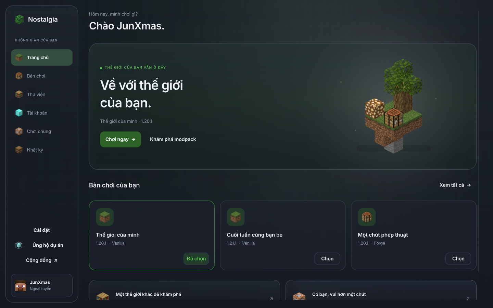
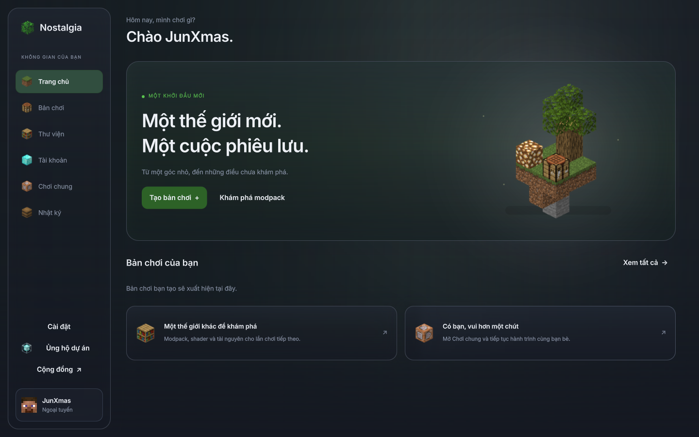
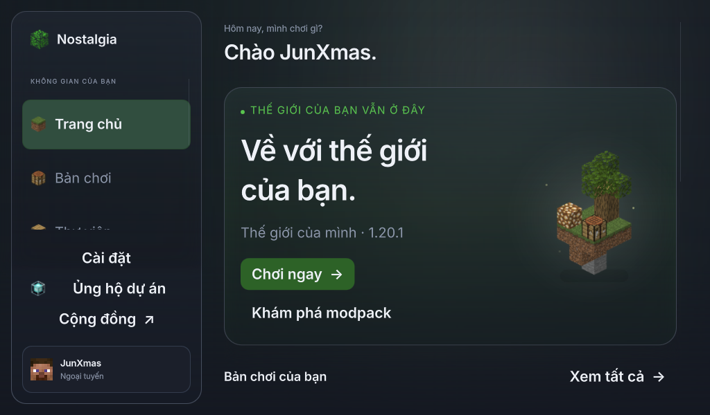

# Home sinh động hơn, dùng khối Minecraft thật

Bản preview trên nhánh local `preview/glass-review`; chưa build, push hoặc phát hành.

## Khối Minecraft

Mọi icon khối nay đọc model và texture gốc Minecraft Java 1.20.1. Khi chưa có game,
launcher dùng tài nguyên vanilla đóng kèm thay vì các mảng màu/nhiễu tự tạo trước đây.
Khi có client, ưu tiên model/texture của client; phần thiếu lấy từ vanilla đóng kèm.

- Cỏ giữ mặt dirt dưới đáy, grass side và lớp phủ cỏ; tint lấy từ colormap của quần xã
  plains trong Minecraft. Lá sồi cũng dùng colormap foliage gốc.
- Bàn chế tạo có đúng texture riêng ở các mặt; kim cương, command block, redstone,
  kệ sách và beacon đều dùng model Minecraft. UV rotation trong model được áp dụng.
- Nhật ký dùng barrel vanilla thật. Không còn khối gỗ giả làm chest; chest của Java
  dùng renderer entity riêng và không phải một cube với texture ván gỗ.
- Đã đối chiếu SHA-1 client chính thức trước khi trích xuất. 48 file model/texture/
  colormap giữ nguyên byte; SHA-256 từng file nằm trong `assets/minecraft-blocks/source.json`.
  Quyền sở hữu/nguồn được ghi trong CREDITS.md.
- Cache icon chuyển sang revision 5 để thay các ảnh tự tạo cũ; không xóa cache cũ,
  không sửa client.jar, bản chơi hoặc tài nguyên của người chơi.

## Trang chủ mới

Thay khối cỏ đơn lẻ bằng một góc nhỏ: mảnh đất, cây sồi, bàn chế tạo và glowstone.
Cảnh được ghép từ geometry/UV/texture của các model Minecraft gốc bằng `home_scene.py`,
không vẽ lại khối. Đây là ảnh render model cho UI, không phải ảnh chụp trong game.
Ảnh trong suốt 1024×1024 được sinh sẵn; lúc dùng chỉ hiển thị PNG, không dựng 3D mỗi frame.

Giữ palette xanh cũ, nút Chơi chính, thông tin bản chơi và nền kính. Thêm chuyển động
trôi 5 px trong 8,8 giây, parallax tối đa 6 px theo chuột và ba đốm sáng nhỏ.
Tất cả animation tắt khi giảm chuyển động, cảnh ẩn hoặc cửa sổ mất focus. Tắt tùy chọn
ảnh nền thì bỏ cảnh và mở rộng phần chữ. Cửa sổ hẹp thu nhỏ cảnh, nút tự xuống dòng.

Hai thẻ ở dưới mở Thư viện và Chơi chung; không tự tải/cài mod hoặc tạo phòng.
Ảnh chọn diện mạo ở lần mở đầu đã được chụp lại để phản ánh Home và icon hiện tại.

## Preview Qt thật







[Video chuyển động và rê chuột](preview/minimal/home-living-motion.mp4).

Ảnh/video ghi từ QQuickView trên OpenGL/llvmpipe, dữ liệu bản chơi/tài khoản là mẫu
ngoại tuyến trong thư mục tạm. Không dùng ảnh AI hoặc giao dịch/game đang chạy để chụp.

## Kiểm chứng và tái tạo

68 kiểm tra liên quan qua trên renderer phần mềm: model/icon vanilla, tint/UV,
cache, ảnh Home sinh lại từ model, bố cục cửa sổ nhỏ/chữ 150%, tùy chọn chuyển động,
luồng preview, chọn diện mạo, quy ước và kiến trúc. 17 kiểm tra Home/preview/thiết lập
cũng qua trên OpenGL/llvmpipe. Ruff qua; mypy 404 file qua.
Ảnh Qt không có cảnh báo QML. Chưa đo GPU Windows; video render không phải benchmark.

```sh
.venv/bin/python bench/ui_minimal_preview.py
.venv/bin/python bench/ui_home_scene.py --output /tmp/home-island.png
```

Chọn diện mạo mới, đăng nhập/khám phá trước rồi vào Home. Lệnh thứ hai sinh lại cảnh từ
model vanilla đóng kèm; kiểm thử so pixel với PNG đang dùng trong UI.
