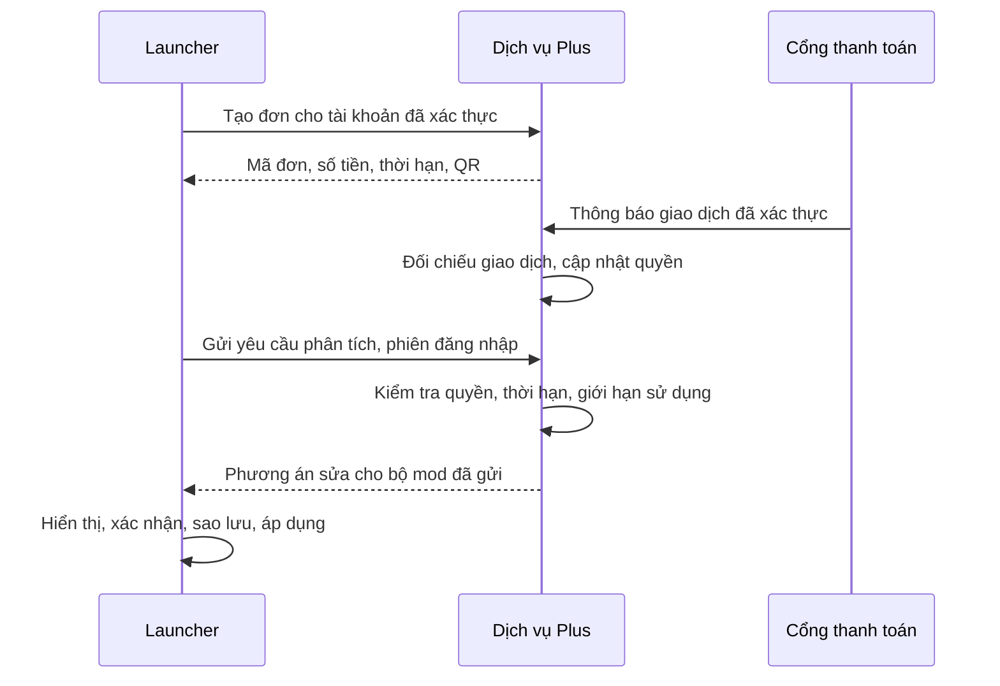

# Nostalgia Plus — đặc tả và giá đã chốt

Hướng sản phẩm đã được chủ dự án duyệt. Đây là đặc tả toàn bộ hệ thống, không phải
bằng chứng mọi tính năng đã triển khai. Phần giao diện và client thanh toán được mô tả
tại [preview thanh toán](PLUS_PAYMENT_PREVIEW.md); backend đăng nhập Google/phiên một máy đã có trong preview; cổng thanh toán
thật và bộ sửa mod vẫn cần triển khai. Chưa nhận thanh toán hoặc thay đổi bản phát hành.
Preview cho phép chọn giao diện cũ/mới; palette và mica giữ theo mẫu đã duyệt.

## Giá trị và mức giá đề xuất

Giá chốt ngày 2026-10-06: **29.000đ/1 tháng, 69.000đ/6 tháng, 109.000đ/12 tháng, 209.000đ/mua đứt**.
Cả bốn gói giữ cùng quyền Plus cốt lõi; gói dài hơn thêm quyền lợi hồ sơ/preview được
đề xuất tại [review mới](PLUS_LIFETIME_REVIEW.md). Nếu gia hạn ở giá khác, phải công bố trước khi thanh toán;
không tự trừ tiền, không mặc định gia hạn. Hết hạn vẫn dùng launcher và bản chơi bình thường.

| | Free | Plus |
|---|---|---|
| Khởi chạy, cài mod/modpack, quản lý bản chơi | Giữ tính năng hiện có | Như Free |
| Kiểm tra xung đột mod | Báo xung đột và các mod/file liên quan | Như Free |
| Phân tích nguyên nhân, chọn phương án sửa | — | Có, theo dữ liệu và quy tắc được hỗ trợ |
| Lập bộ phiên bản tương thích và áp dụng sửa | — | Có, sau khi xem và xác nhận thay đổi |
| Sao lưu trước sửa, hoàn tác | — | Có trong luồng sửa |

Không khóa các thao tác quản lý mod hiện có như bật/tắt, gỡ hoặc đổi phiên bản thủ công.
Free cũng cần báo lỗi rõ; không làm thông báo mơ hồ để ép nâng cấp.
Không cam kết phát hiện/sửa mọi lỗi: thiếu metadata, lỗi logic, mixin, cấu hình và lỗi chỉ
xuất hiện trong thế giới cụ thể có thể chưa xác định được.

Khoản ủng hộ tùy tâm vẫn là luồng riêng, có thể chuyển số tiền bất kỳ và không mặc nhiên
cấp Plus. Luồng Plus ghi rõ số tiền, thời hạn, quyền lợi và điều kiện trước khi trả tiền.
Không dùng nội dung «ủng hộ tùy tâm» cho một giao dịch đổi lấy quyền sử dụng tính năng.

Theo yêu cầu mới, thêm gói mua đứt 209.000đ. Quyền không hết hạn trong thời gian dịch vụ
hoạt động, vẫn có giới hạn sử dụng và thu hồi khi hoàn tiền. Chi phí máy chủ tiếp tục
phát sinh nên cần đo chi phí mỗi account trước mở bán.
Không bao gồm hỗ trợ trực tiếp không giới hạn hoặc AI không giới hạn trong mức giá này.
Bốn gói được chọn rõ trước tạo đơn; giá/thời hạn vẫn phải do backend xác nhận.

## Ranh giới bảo vệ quyền Plus

Không thể chống mọi bản sửa launcher trên máy người dùng. Cờ trong JSON, khóa trong QML,
obfuscation hoặc kiểm tra toàn vẹn máy khách không phải bằng chứng quyền sử dụng.
Mục tiêu kiểm chứng được: tài khoản không có quyền Plus không nhận được kết quả phân tích
nâng cao hay phương án sửa từ dịch vụ của dự án, kể cả gọi API trực tiếp hoặc sửa UI.

- Máy chủ giữ dữ liệu quyền, bộ quy tắc nâng cao, bộ giải phụ thuộc và tra cứu bản mod.
  Không gửi bộ giải về launcher sau khi kích hoạt; nếu gửi về, nó có thể bị trích xuất.
- Kiểm tra quyền ở mọi endpoint phân tích/lập phương án. Cờ hiển thị Plus của UI chỉ phục
  vụ giao diện. Có API riêng cũng không đủ nếu máy khách gửi `paid=true` là được tin.
- Phiên đăng nhập ngắn hạn, có cơ chế gia hạn, hết hạn và thu hồi. Xác thực tài khoản
  ủng hộ riêng; không tin tên tài khoản Minecraft ngoại tuyến hoặc email tự khai.
- Không gửi token Minecraft/Microsoft/Ely.by cho dịch vụ thanh toán hay dịch vụ Plus.
- Lưu token bằng kho thông tin xác thực của hệ điều hành; không log token. Token đọc
  được bởi chủ máy vẫn có thể bị chia sẻ: chỉ cho phép **một phiên Nostalgia đang hoạt động**;
  đăng nhập máy mới thu hồi phiên cũ ở máy chủ; không khóa bằng HWID cố định.
- Quyền hết hạn/thu hồi phải chặn API. Đồng hồ client không quyết định thời hạn.
  Lỗi xác thực hoặc mất mạng không tự chuyển thành Plus. Free và chức năng chơi vẫn chạy.
- Giới hạn tốc độ, kích thước yêu cầu, số yêu cầu song song và ngân sách xử lý theo tài
  khoản ở máy chủ. Giới hạn quyền lợi được công bố; giới hạn chống lạm dụng không thay
  thế xác thực.
- Ràng buộc phương án với tài khoản và mã băm bộ mod đầu vào. Kết quả dùng được trên
  bộ mod đó; không phải khóa mở mọi tính năng vĩnh viễn.
- Người đã mua có thể lưu/chia sẻ thông tin họ nhận được, hoặc tự viết bộ sửa khác.
  Không thể ngăn tuyệt đối việc đó; không quảng cáo «không thể bypass».

## Thanh toán và cấp quyền

Ưu tiên VietQR qua nhà cung cấp có thông báo thanh toán xác thực, chẳng hạn payOS;
cần kiểm tra điều kiện tài khoản, phí và hợp đồng hiện hành trước khi tích hợp.
Phương án xác nhận thủ công có thể dùng cho thử nghiệm ít người: quản trị viên xác nhận
sau khi đối chiếu giao dịch thật, rồi máy chủ cấp quyền. Không nhúng khóa quản trị vào app.
Cả hai phương án đều cần dịch vụ máy chủ; mã QR ủng hộ hiện có chưa cung cấp chức năng này.

1. Máy chủ tạo đơn cho người nhận quyền đã xác thực, dùng giá và chương trình ưu đãi
   từ máy chủ. Client không được tự đặt giá, thời hạn hay tài khoản nhận tiền.
2. Đơn có mã duy nhất, đơn vị tiền tệ, số tiền chính xác, hạn thanh toán và phiên bản gói.
3. Xác minh chữ ký/thông tin xác thực theo giao thức nhà cung cấp; đối chiếu trạng thái,
   mã đơn, số tiền, đơn vị tiền và giao dịch với dữ liệu máy chủ. Tra cứu lại khi cần.
4. Ghi nhận giao dịch và cấp quyền trong một giao dịch cơ sở dữ liệu. Mã giao dịch và
   mã đơn có ràng buộc duy nhất: thông báo lặp hoặc xử lý song song chỉ cấp quyền một lần.
5. Client hỏi trạng thái đơn gắn với tài khoản; trang quay về sau thanh toán và nút
   «Kiểm tra thanh toán» chỉ kiểm tra trạng thái, không cấp quyền.
6. Đơn chưa trả, trả thiếu, sai nội dung hoặc đã hết hạn không tự cấp quyền. Cần luồng
   xử lý ngoại lệ đối chiếu được; công bố chính sách trước khi nhận tiền.
7. Gia hạn bắt đầu từ ngày hết hạn nếu quyền còn hiệu lực, hoặc ngày giao dịch được
   xác nhận nếu đã hết hạn. Hoàn tiền/thu hồi quyền cần lưu lịch sử đối chiếu.

Không cấp Plus chỉ vì chuyển đúng số tiền của một gói vào QR cũ: không đủ để biết người
nhận quyền, gói đã chọn hoặc đơn nào được thanh toán.

## Luồng sửa lỗi Plus

1. Quét chỉ đọc ở máy khách: metadata, tên file, mã băm, phiên bản game/loader.
   Free dùng phần này để báo các xung đột được nhận diện.
2. Plus gửi bản kê tối thiểu để máy chủ phân tích. Không tự gửi JAR, thế giới chơi,
   đường dẫn cá nhân hoặc toàn bộ log. Nếu cần đoạn log, hiển thị dữ liệu trước khi gửi
   và loại thông tin nhạy cảm; có chính sách lưu/xóa dữ liệu.
3. Dịch vụ xét cả phụ thuộc theo khoảng phiên bản và bất tương thích đã khai báo;
   phụ thuộc không tìm được phải báo không giải được. Không bỏ qua phụ thuộc bắt buộc.
4. Trả phương án có bằng chứng: file nào thêm, đổi, tắt; lý do; bản thay thế; mức chắc
   chắn. Lỗi chưa rõ chỉ được gợi ý, không tự tắt mod dựa trên một dòng stack trace.
5. Client xác nhận bộ mod chưa đổi, game đã tắt, không có thao tác cài/xóa đang chạy.
   Người chơi duyệt thay đổi rồi mới thực hiện. Không ghi lên thế giới đang mở.
6. Chỉ tải bản phát hành qua nguồn hỗ trợ, kiểm tra hash, không tải từ URL tùy ý của
   kết quả phân tích. Tải vào vùng tạm trước; không áp dụng script/lệnh shell từ máy chủ.
7. Sao lưu file mod/cấu hình/sổ theo dõi bị tác động; đổi file khi mọi tải đã thành công,
   giữ dữ liệu cũ nếu tải/apply thất bại. Không tự xóa hoặc sửa thế giới chơi.
8. Có lịch sử và hoàn tác kiểm tra được. Kiểm tra trước chạy không chứng minh game đã
   chạy ổn; nếu cần thử chạy, dùng bản chơi sao chép và có xác nhận của người dùng.

Trước mắt tập trung Fabric và Forge; công bố phạm vi được hỗ trợ. Giải phụ thuộc theo
metadata và quy tắc đã kiểm chứng trước, chưa dùng AI làm tác nhân sửa file.

## Nền tảng và lộ trình

Cloudflare Workers + D1 là lựa chọn hợp với hạ tầng hiện có cho đơn, quyền và bộ phân
tích nhẹ. Tác vụ nặng phải có giới hạn và có thể tách thành hàng đợi/dịch vụ riêng sau
khi đo thực tế. Mã dịch vụ ở kho riêng như các Worker hiện có; public client không giữ
khóa thanh toán hoặc khóa ký phiên. Không gọi thử endpoint thanh toán chưa được triển khai.

- Bước 1: quét chỉ đọc Free, schema bản kê mod và các bộ mod kiểm thử.
- Bước 2: bộ phân tích Plus trên máy chủ, trả phương án có bằng chứng, chưa áp dụng.
- Bước 3: sao lưu/apply/hoàn tác và thử nghiệm bằng bản chơi sao chép.
- Bước 4: đăng nhập tài khoản ủng hộ, quyền và thanh toán sandbox; chỉ mở bán sau khi
  kiểm thử xuyên suốt bằng môi trường thanh toán được cung cấp.

Kiểm thử bắt buộc: API gọi trực tiếp không quyền; token giả/hết hạn/thu hồi; giả webhook;
trả thiếu/sai đơn; sự kiện lặp và song song; giới hạn yêu cầu; bộ mod đổi giữa scan/apply;
file symlink/đường dẫn vượt thư mục; tải lỗi; rollback; server mất mạng. Sửa cờ trong UI
phải không lấy được phương án sửa từ API.

Trước mở bán cần xác định quyền thương mại của mã/thư viện/asset Minecraft hiện dùng;
không sao chép mã GPL vào sản phẩm đóng nguồn hoặc mã PCL khi chưa đáp ứng giấy phép.
Quyền dùng thương mại của chủ sở hữu không được suy ra từ quyền của người tải mã nguồn.

## Đo xem mô hình có giúp dự án phát triển

Thử với nhóm người chơi nhỏ trước khi mở bán: đo lỗi có chẩn đoán đúng, số phương án
người chơi chấp nhận, tỷ lệ sửa thành công, hoàn tác và thời gian tiết kiệm. Chưa có
dữ liệu để dự đoán tỷ lệ mua. Báo cáo đóng góp của Plus cho phát triển launcher theo
kết quả thực tế, không hứa lịch tính năng cố định khi chưa đủ nguồn lực.

109.000đ/năm tương đương doanh thu gộp khoảng 9.083đ/tháng/người; gói 6 tháng là 11.500đ/tháng.
Cần trừ phí giao dịch, thuế, hoàn tiền, hạ tầng và thời gian hỗ trợ để đánh giá có lãi.
Điều kiện mở bán: chi phí mỗi tài khoản nằm trong ngân sách và luồng sửa/hoàn tác được
kiểm chứng. Giá ra mắt không phải bằng chứng mô hình bền vững.

Xem [Google, bạn bè và phiên một máy](GOOGLE_FRIENDS_PREVIEW.md) cho phần đã triển khai và giới hạn kiểm thử.
