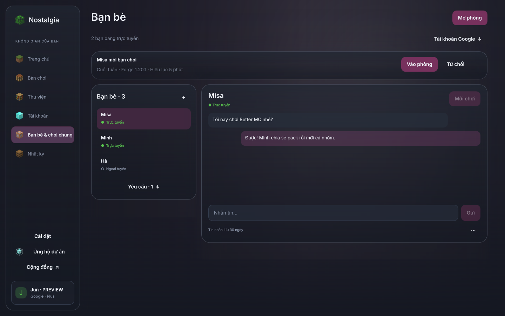
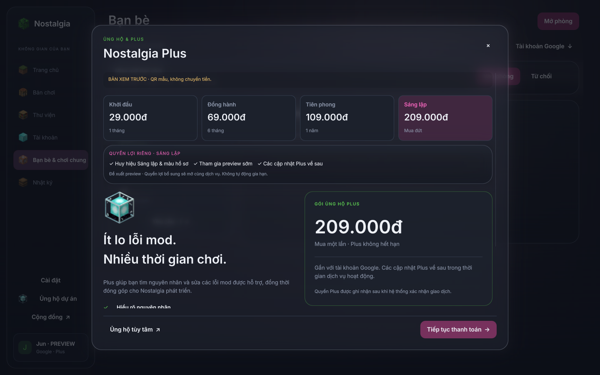

> Tài liệu review giai đoạn trước. Bản rc2 đã bổ sung runtime release, payOS, hồ sơ Plus và sửa mod.
> Trạng thái hiện tại và hướng dẫn thử: [DRAFT_TEST_GUIDE.md](DRAFT_TEST_GUIDE.md).

# Gói mua đứt và trang Bạn bè thu gọn — review preview

Ngày 2026-10-06, nhánh local `preview/glass-review`. Chưa build installer, push, tag,
release hoặc deploy. Kế thừa [Google/bạn bè/phiên một máy](GOOGLE_FRIENDS_PREVIEW.md).

## Chính sách gói

| Gói | Giá chốt | Quyền lợi thêm đề xuất |
|---|---:|---|
| Khởi đầu · 1 tháng | 29.000đ | Plus cốt lõi |
| Đồng hành · 6 tháng | 69.000đ | Huy hiệu Đồng hành, màu hồ sơ |
| Tiên phong · 1 năm | 109.000đ | Huy hiệu Tiên phong, màu hồ sơ, preview sớm |
| Sáng lập · mua đứt | 209.000đ | Huy hiệu Sáng lập, màu hồ sơ, preview sớm, cập nhật Plus về sau |

Giữ chat/chơi chung miễn phí và cùng khả năng Plus cốt lõi ở các gói. Quyền lợi cao hơn
hướng đến hồ sơ và đồng hành dự án, không làm gói tháng bị thiếu chức năng sửa mod.
Không tự gia hạn. Mua đứt không hết hạn trong thời gian dịch vụ hoạt động; vẫn có giới
hạn sử dụng dịch vụ và chính sách thu hồi/hoàn tiền. Không bao gồm hosting riêng hoặc
hỗ trợ/AI không giới hạn. Cần đo chi phí hạ tầng trước mở bán ở mức mua đứt 209.000đ.

## Mã đã triển khai và phần còn thiếu

- Có catalog bốn gói ở backend, chọn offer qua HTTPS, xác nhận giá/gói trước tạo đơn.
  Client chỉ gửi offer ID, không gửi thời hạn/giá tự quyết định.
- Có lifetime rõ ràng trong offer/order/model, biên nhận hiển thị Không hết hạn. Gói
  0 tháng thiếu cờ lifetime không được chấp nhận; paid thiếu cờ, sai cờ hoặc thời hạn
  null/boolean/chuỗi/nonzero bị từ chối.
- Có schema metadata membership, authorizer đọc quyền D1 và relay chấp nhận lifetime
  đã xác minh. Lifetime vẫn bị thu hồi, vẫn dùng chính sách một phiên: máy mới đăng
  nhập khiến session host cũ không còn publish/download pack được.
- Có huy hiệu chính tài khoản đọc theo loại membership có quyền. Màu hồ sơ, huy hiệu
  trong danh sách bạn bè và kênh phân phối preview sớm **chưa triển khai**. Cửa sổ chọn
  gói ghi rõ các quyền lợi thêm là đề xuất preview, chưa phải cam kết dịch vụ đang bán.
- OAuth/friends/chat/backend gate đã có mã preview, nhưng chưa cấu hình Google OAuth
  thật/domain/shared D1/R2/service binding. Payment binding và engine sửa mod chưa có.
  Không nhận tiền thật hoặc tự bật dịch vụ trong bản release hiện hành.

## Trang Bạn bè

Desktop chỉ tập trung danh sách và trò chuyện. Tài khoản Google, thêm bạn, yêu cầu
kết bạn và tùy chọn phòng mở theo thao tác. Danh sách có scroll riêng khi đông bạn.
Chat có ô nhập và Gửi cùng hàng, tùy chọn chặn/làm mới dưới nút ···.

Ở cửa sổ hẹp chỉ hiện danh sách hoặc chat. Lời mời gấp thành một dòng, nút quay lại
rõ ràng, vùng tin nhắn co theo chiều cao để ô nhập còn nhìn thấy ở 1024×600/chữ 150%.
Đổi người nhận xóa bản nháp tránh gửi nhầm. Chờ LAN hướng dẫn ngắn, nhập cổng dự phòng
nằm dưới Không tìm thấy LAN. Palette cũ, mica và model Minecraft được giữ nguyên.

## Bằng chứng kiểm tra

- 189 kiểm tra Python/Qt/HTTPS/multiplayer/account/kiến trúc qua. Bao gồm gói tháng,
  6 tháng, năm và lifetime, không đổi gói của đơn đang chờ, receipt xác minh nghiêm,
  single session và bố cục/ô nhập chat ở 100% và 150%.
- 16 kiểm tra Node/workerd/D1/R2 qua. Google được fixture ở biên mạng, RSA và D1 thật;
  thu hồi entitlement/membership và phiên host với cả gói thời hạn/lifetime được kiểm.
- 24 kiểm tra Qt trên OpenGL qua, chạy riêng sau nhóm software; 6 ảnh Qt OpenGL thật, không cảnh báo QML.
- Ruff và mypy qua. Chưa thử Google production, thanh toán thật, Windows/macOS
  keychain thật hoặc Minecraft modpack trên nhiều máy; không suy ra chúng đã hoạt động
  từ fixture. Một bearer có thể bị chủ máy sao chép, không tuyên bố chống bypass tuyệt đối.

## Ảnh duyệt

Dữ liệu và giao dịch trong ảnh đều **DEMO/PREVIEW**, không chuyển tiền/cấp Plus thật.

[Chat nhỏ 150%](preview/minimal/friends-compact-small-chat.png) ·
[Danh sách nhỏ 150%](preview/minimal/friends-compact-small-list.png) ·
[Chờ LAN](preview/minimal/friends-compact-lan.png) ·
[Biên nhận mua đứt](preview/minimal/plus-lifetime-receipt.png)
