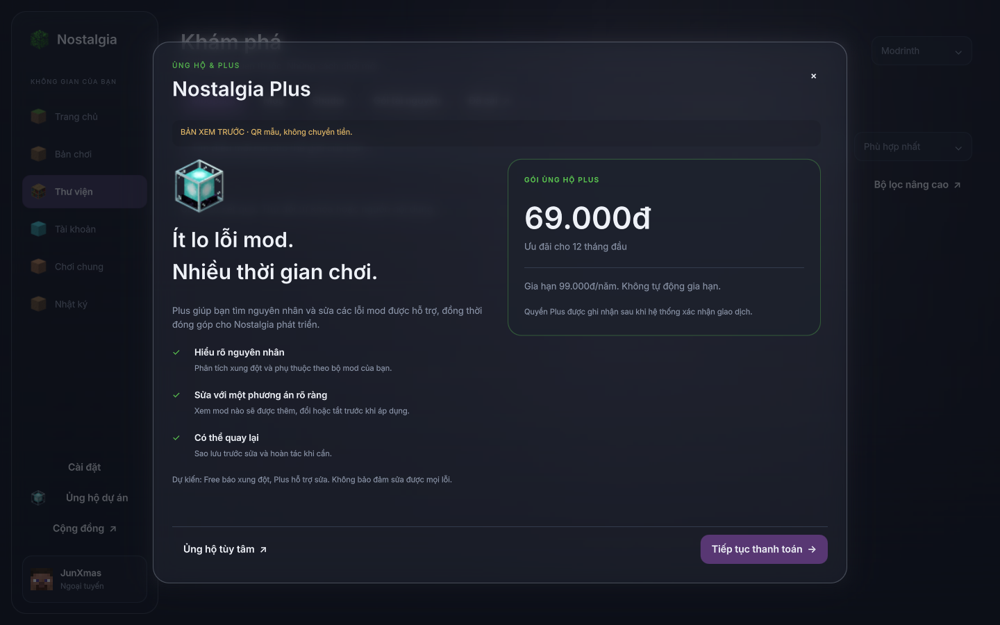
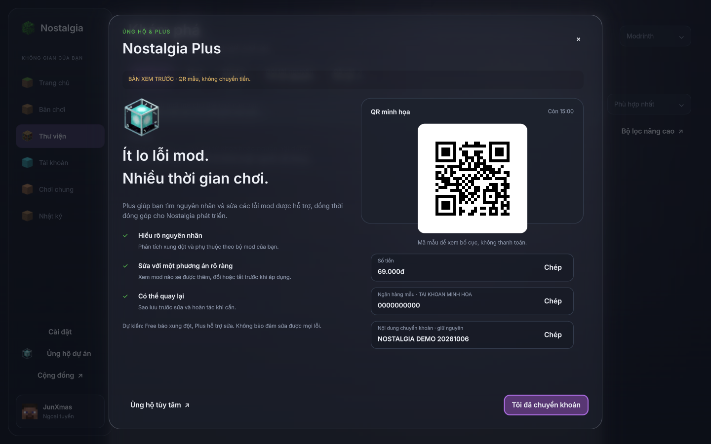
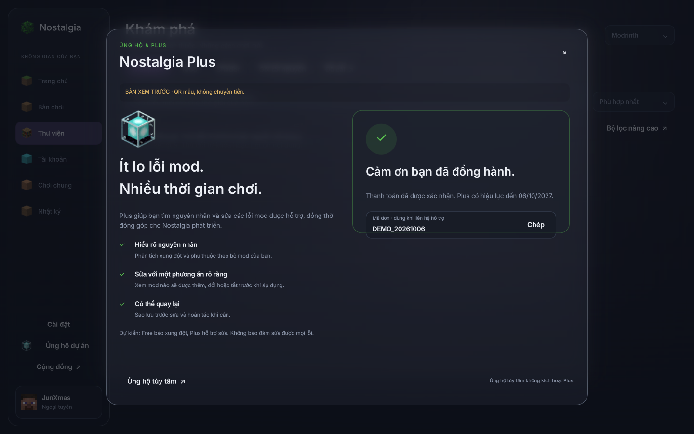
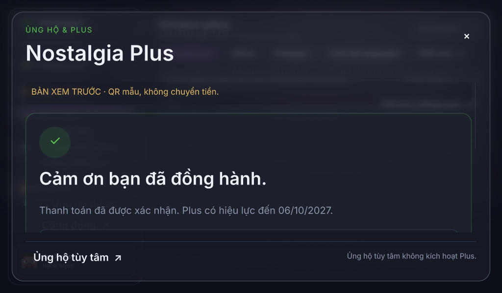

# Preview thanh toán Plus

Chỉ giao diện mới, palette cũ, popup mica lấy nền thật và beacon từ model Minecraft.
Nhánh local `preview/glass-review`; chưa build, push, tạo tag hoặc phát hành.

## Đã triển khai

- Mục Ủng hộ mở màn Plus: quyền lợi, 69.000đ cho 12 tháng đầu, gia hạn 99.000đ/năm,
  không tự gia hạn. Giá thật luôn lấy từ backend; giá chưa nạp được chỉ là mẫu, nút tạo
  đơn bị khóa. Free/Plus là phạm vi tính năng dự kiến, chưa phải bộ sửa mod đang hoạt động.
- Thanh toán có QR, số tiền, ngân hàng/người nhận, số tài khoản và nội dung chuyển khoản.
  Có sao chép; ảnh QR vẽ ở kích thước gốc, không phóng/co làm lệch ô. Nút chính luôn
  nằm ở cạnh dưới; cửa sổ nhỏ/chữ 150% ưu tiên nội dung thanh toán rồi mới tới quyền lợi.
- Hỏi trạng thái mỗi 5 giây khi popup mở. Đóng popup dừng polling; mở lại giữ đơn.
  Mở cửa sổ mới lấy đơn hiện hành của tài khoản từ backend trước khi cho tạo đơn mới.
- Mất mạng giữ đơn để thử lại; retry tạo đơn giữ cùng Idempotency-Key. Client không
  được quyết định hết hạn thanh toán bằng đồng hồ của mình: hết giờ thì ẩn QR và đối chiếu
  với máy chủ. Trạng thái thành công/hết hạn/hủy đều có màn riêng, có sao chép mã đơn.
- Nút «Tôi đã chuyển khoản» chỉ gọi API kiểm tra. Không có slot «đánh dấu đã trả tiền».
  JSON sai mã đơn/gói/giá, trạng thái lạ, phiên hết hạn, lỗi HTTP hoặc redirect không thành
  xác nhận thành công. Client không chứa khóa payOS hay khóa quản trị.
- Ủng hộ tùy tâm mở dialog VietQR hiện có, ghi rõ không kích hoạt Plus. Không tự đổi
  khoản ủng hộ cũ thành đơn Plus.

## Ảnh Qt thật

Ảnh chụp từ QQuickView trên OpenGL/llvmpipe, 1440×900 và 1024×600/cỡ chữ 150%.
Dữ liệu ngân hàng và giao dịch là mẫu. QR chỉ chứa chữ DEMO, không chứa lệnh chuyển
khoản và không thể kích hoạt Plus. Trạng thái thành công là phản hồi từ gateway mẫu.







Xem thêm [đơn hết hạn](preview/minimal/plus-expired.png) và
[lỗi mạng giữ nguyên đơn](preview/minimal/plus-network-error.png).



## Chạy thử

```sh
.venv/bin/python bench/ui_minimal_preview.py --payment-demo
```

Vào «Khám phá launcher» nếu chưa đăng nhập, rồi «Ủng hộ dự án». Cờ này chỉ tiêm
gateway mẫu từ `bench/`, không bật trong điểm vào phát hành. Có banner «QR mẫu,
không chuyển tiền» ở mọi màn demo; nút mở cổng thanh toán thật bị ẩn.

Chạy không có cờ thì nút thanh toán chưa mở. Để kiểm thử với backend đã triển khai,
runner hỗ trợ `--plus-url https://<backend>` và `--plus-session-file <file>`.
File chứa phiên tài khoản ủng hộ đã xác thực, không phải API key payOS/token Minecraft.
Đây là cấu hình thử nghiệm cho người phát triển, chưa phải luồng đăng nhập sản phẩm;
không ghi file phiên vào Git. Hai cờ phải đi cùng nhau và không dùng cùng chế độ demo.

## Hợp đồng API phía máy chủ

Mọi request dùng HTTPS và `Authorization: Bearer <support-session>`. Client không lấy
quyền Plus từ file cấu hình địa phương. Không triển khai endpoint giả ở Worker hiện có.

| Endpoint | Trách nhiệm |
|---|---|
| `GET /v1/plus/offer` | Gói/giá/thời hạn áp dụng cho tài khoản đã xác thực; nếu có đơn hiện hành thì trả gói đã khóa của đơn đó. |
| `GET /v1/plus/orders/current` | Đơn hiện hành/biên nhận có liên quan của tài khoản, hoặc JSON `null`; không được trả đơn của người khác. |
| `POST /v1/plus/orders` | Chỉ nhận `offer_id`, thêm header `Idempotency-Key`; máy chủ quyết định giá và người nhận. Một tài khoản có đơn hiện hành không tạo thêm đơn trùng. |
| `GET /v1/plus/orders/<order_id>` | Đối chiếu quyền sở hữu rồi trả trạng thái đã xác thực với cổng thanh toán. |

Gói trả `offer_id`, `amount`, `regular_amount`, `currency: "VND"`,
`duration_months: 12`. Tiền là số nguyên, không phải chuỗi hoặc boolean.

Đơn trả `order_id`, `offer_id`, `amount`, `currency`,
`status: "pending" | "paid" | "expired" | "cancelled"`, `expires_at` (Unix seconds).
Đơn chờ có `bank_name`, `holder`, `account_number` (chuỗi chữ số ASCII), `transfer_memo`,
`qr_image` (PNG dạng data URI; vuông 128–256 px; đủ quiet zone, không rescale module).
`checkout_url` tùy chọn phải là HTTPS tại đúng `pay.payos.vn`. Biên nhận thành công có
`active_until` từ giao dịch cấp quyền phía máy chủ. Các mốc thời gian phải hợp lệ và
không vượt năm 2100. API đọc đơn không được thay mã đơn, giá, hạn, tài khoản/người nhận
hoặc nội dung chuyển khoản giữa các lần kiểm tra.

Máy chủ phải xác thực thông báo payOS theo giao thức nhà cung cấp, đối chiếu mã đơn,
số tiền, đơn vị tiền, trạng thái và mã giao dịch; ghi giao dịch/cấp quyền nguyên tử và
idempotent. Không lấy `paid=true`, return URL, ảnh biên lai hay lời client làm bằng chứng.
Giá/tài khoản nhận tiền/QR phải nhất quán; client tin backend đã xác thực qua TLS, không
tự giải mã QR để đối chiếu toàn bộ nội dung thanh toán.

## Còn cần để hoạt động thật

- Backend riêng, tài khoản payOS và các khóa bí mật lưu ở máy chủ; migration dữ liệu
  đơn/giao dịch/quyền, xác thực và kiểm thử webhook trùng/giả/sai tiền.
- Đăng nhập tài khoản ủng hộ, gia hạn/thu hồi phiên qua kho credential của hệ điều hành,
  trạng thái quyền Plus thực tế và lịch sử đơn; chính sách thanh toán/hỗ trợ/hoàn tiền.
- Bộ phát hiện xung đột Free, bộ phân tích/sửa Plus và sao lưu/hoàn tác. Client checkout
  không tự kích hoạt một bộ sửa chưa có. Mọi API Plus phải kiểm tra quyền ở máy chủ;
  sửa giao diện local thành «đã trả tiền» không được mở các API đó.

Chưa có quyền truy cập mã backend riêng hoặc cấu hình nhà cung cấp trong workspace.
Đã test HTTPS giả và Qt thật; chưa giao dịch thật/sandbox payOS, chưa chứng minh bảo vệ
quyền trên dịch vụ chưa triển khai. Không quảng cáo hệ thống chống bypass tuyệt đối.

## Kiểm chứng

61 kiểm tra liên quan qua trên renderer phần mềm: giao thức thanh toán, tương tác/
khôi phục đơn, preview, popup dự án, ranh giới API, kiến trúc và quy ước. 9 kiểm tra
thanh toán/khôi phục cũng qua trên OpenGL/llvmpipe. Ruff toàn kho và mypy 396 file qua.
Sáu ảnh Qt được chụp trên OpenGL, không có cảnh báo QML. Đã kiểm tra vùng mica khớp
vị trí sau resize, thao tác bàn phím, sao chép, cỡ chữ 150% và nút chính cố định.

Xem `tests/payment/test_gateway.py`, `tests/ui/test_payment_ui.py` và
`tests/ui/test_payment_recovery.py`. Hai ca test bàn phím từng gặp thời điểm binding
chưa cập nhật; fixture thanh toán đã chờ nút clickable và xử lý sự kiện trước khi bấm.
Kiểm tra popup shader riêng và bộ liên quan sau sửa đều qua. Chưa đo GPU Windows hoặc
kiểm chứng giao dịch payOS thật/sandbox.
