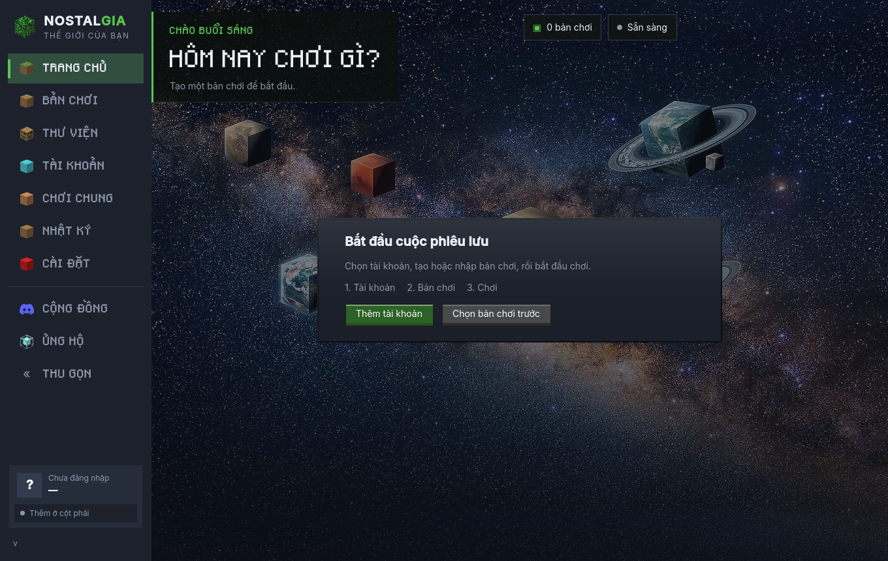
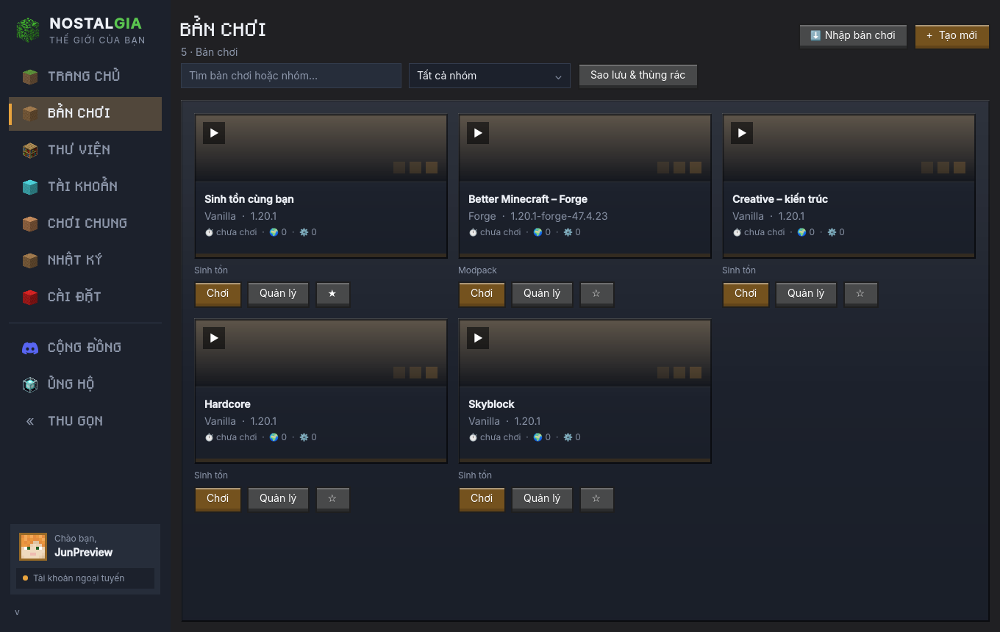
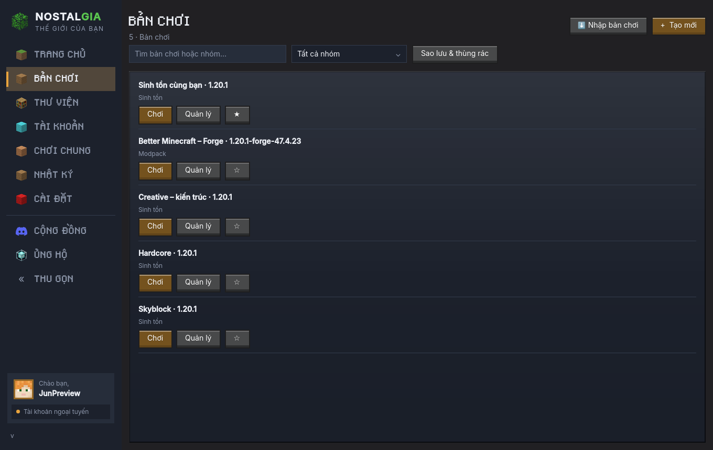
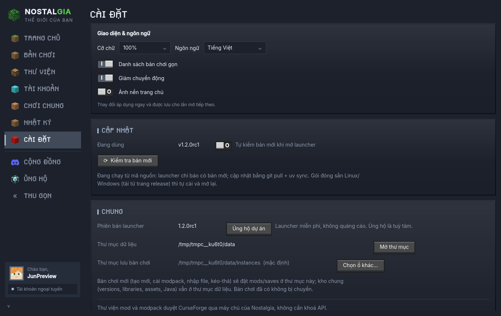
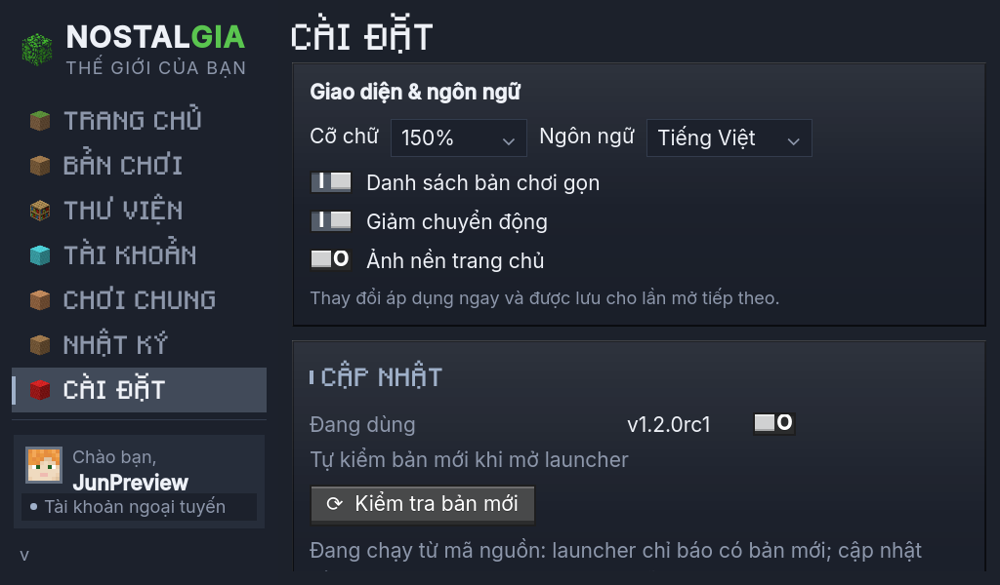

# Preview 1.2.0rc1 — để chủ dự án duyệt

Hai bản vá Forge và model Minecraft đã phát hành ổn định ở [v1.1.8](https://github.com/JunXmas/NostalgiaLauncher/releases/tag/v1.1.8). Nhánh preview này bổ sung các cải tiến UX, chưa gộp vào main.

## Những thay đổi có thể dùng thử

- Trang chủ chưa đủ tài khoản/bản chơi có một thẻ bắt đầu, dẫn đến thao tác tiếp theo. Khi đủ dữ liệu, trở lại màn hình chơi gần đây.
- Thanh bên cuộn độc lập với thẻ tài khoản; bề rộng thích ứng khi tăng chữ.
- Chữ nội dung 14 px, nhãn 12 px; mặt nút tối hơn để chữ trắng rõ ở cả trạng thái hover.
- Cài đặt có cỡ chữ 100/125/150%, danh sách gọn, giảm chuyển động và bật/tắt nền trang chủ. Lưu trên máy và áp dụng ngay.
- Chuyển Việt/Anh ngay trong Cài đặt; bổ sung khoảng 290 chuỗi giao diện. Thông báo kỹ thuật từ backend, tên nội dung bên ngoài và menu khay hệ thống chưa được dịch toàn bộ.
- Bản chơi có tìm kiếm, lọc nhóm, ghim lên đầu; nút Quản lý luôn thấy được. Sửa tên/nhóm/ghim/RAM/kích thước cửa sổ ở cùng hộp thoại.
- Sao lưu save/mods/config thành ZIP; khôi phục sang mã bản chơi mới, từ chối ghi đè thư mục có sẵn.
- Chuyển bản chơi vào thùng rác và khôi phục. Thư mục chơi ở ổ khác được giữ nguyên; khôi phục đổi mã nếu mã cũ đã được dùng.
- Lỗi còn nhìn thấy cho đến khi đóng hoặc thử lại; hộp chi tiết có sao chép đầy đủ. Thử lại tác vụ lỗi sau khi mạng hoạt động trở lại.
- Nút, công tắc, hộp chọn và điều hướng chính có thao tác bàn phím, viền focus và nhãn accessibility.
- Forge trong danh sách hiển thị số ngắn, vẫn giữ tên đầy đủ để cài đặt. Duyệt modpack không hiện lựa chọn bản chơi đích không cần thiết.

Beacon và bookshelf tiếp tục dùng model/texture **Minecraft Java 1.20.1 nguyên bản**, không thay bằng hình tự thiết kế. Các asset và nguồn nằm tại `src/nostalgia/ui/qml/assets/minecraft-blocks/`.

## Cách thử trước khi chốt

Tải bộ cài hoặc ZIP Windows ở [preview release](https://github.com/JunXmas/NostalgiaLauncher/releases/tag/v1.2.0rc1). ZIP có thể chạy từ thư mục riêng; cần đặt `NOSTALGIA_DATA_DIR` và `NOSTALGIA_CONFIG_DIR` nếu muốn thử với dữ liệu tách biệt. Chạy ZIP từ thư mục khác **không tự tách dữ liệu**.

1. Thử tạo Forge 1.20.1/47.4.23 và cài một modpack Forge trên máy thật.
2. Bản chơi: gõ tìm kiếm, ghim, mở Quản lý và tạo nhóm. Chuyển Danh sách gọn trong Cài đặt.
3. Tạo bản sao lưu từ một bản chơi thử nghiệm, sửa một file, khôi phục dưới mã mới và so sánh.
4. Chuyển bản chơi thử nghiệm vào thùng rác rồi khôi phục từ Sao lưu & thùng rác.
5. Thu cửa sổ còn 1024×600; thử chữ 150%, cuộn điều hướng/Cài đặt và dùng Tab/Enter/Space.
6. Bật/tắt nền, giảm chuyển động và đổi ngôn ngữ; đóng/mở lại để kiểm tra tùy chọn đã lưu.

Với ZIP trên Windows có thể dùng PowerShell để mở một phiên thử độc lập:

```powershell
$env:NOSTALGIA_DATA_DIR = Join-Path $env:TEMP 'NostalgiaPreview-data'
$env:NOSTALGIA_CONFIG_DIR = Join-Path $env:TEMP 'NostalgiaPreview-settings'
.\nostalgia.exe
```

Nếu tên executable khác, chọn file `.exe` trong thư mục giải nén. Không dùng dữ liệu chơi duy nhất để thử luồng khôi phục đầu tiên.

## Những điểm cần chủ dự án chốt

| Nội dung | Hướng đang thử |
| --- | --- |
| Độ trang trí | Giữ bản sắc Minecraft và ảnh nền mặc định, cho phép tắt nền |
| Mật độ | Lưới mặc định; danh sách gọn là tùy chọn |
| Typography | Chữ nội dung sans rõ hơn, giữ pixel ở nhãn ngắn/tiêu đề |
| Quản lý bản chơi | Thao tác luôn thấy; nhóm/ghim/tìm kiếm trước khi làm hệ theme lớn |
| Màn hình mới cài | Một hành động chính theo bước còn thiếu |

Chưa có khảo sát trực tiếp người dùng Nostalgia. Lựa chọn trên là giả thuyết từ nghiên cứu tài liệu và đối chiếu sản phẩm, không phải kết luận đa số người dùng thích kiểu này. Nguồn: [Tuch et al., 2012](https://research.google/pubs/the-role-of-visual-complexity-and-prototypicality-regarding-first-impression-of-websites-working-towards-understanding-aesthetic-judgments/), [NN/g về tối giản](https://www.nngroup.com/articles/aesthetic-minimalist-design/), [Prism themes](https://prismlauncher.org/wiki/getting-started/change-themes/), [Modrinth personalization](https://modrinth.com/news/article/app-personalization/), [WCAG contrast](https://www.w3.org/WAI/WCAG22/Understanding/contrast-minimum.html).

## Phạm vi và giới hạn

Sao lưu tối đa 16 GiB dữ liệu giải nén và 100.000 file; từ chối symlink và file đặc biệt. Kho dùng chung versions/libraries/assets/Java và tài khoản không nằm trong ZIP. Khôi phục trên máy khác cần cài lại phiên bản game/loader; ở cùng máy kho được dùng lại. UI chặn sao lưu/khôi phục khi đang chạy hoặc khởi động game và chặn chơi khi thao tác dữ liệu đang chạy. Chương trình bên ngoài vẫn có thể sửa file; nên dừng mọi chương trình ghi thế giới khi sao lưu.

Thùng rác giữ file đến khi người dùng tự quản lý trên đĩa; preview chưa có chức năng dọn rác/xoá vĩnh viễn trong UI. Khôi phục trùng mã tạo một mã mới. Không thay cơ chế tự cập nhật ổn định; preview được phát hành dưới dạng prerelease để bản ổn định không tự nhận nó.

Kiểm tra UI dùng Qt thật ở chế độ offscreen, dữ liệu cục bộ và installer test cho luồng Forge/modpack. Build/smoke test đa hệ được thực hiện trên GitHub Actions; không tương đương chạy game tương tác trên máy Windows của người dùng. Môi trường phát triển cần proxy mạng, nên chưa xác nhận tải/cài Forge từ Internet bằng đường kết nối trực tiếp của launcher.

## Ảnh preview từ Qt thật

Các ảnh dùng dữ liệu bản chơi cục bộ phục vụ duyệt UI, không phải thống kê người dùng thật.










