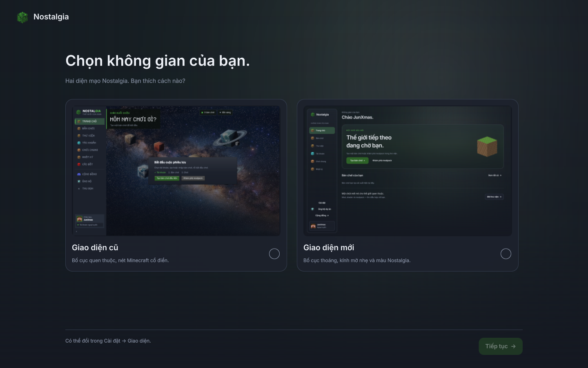
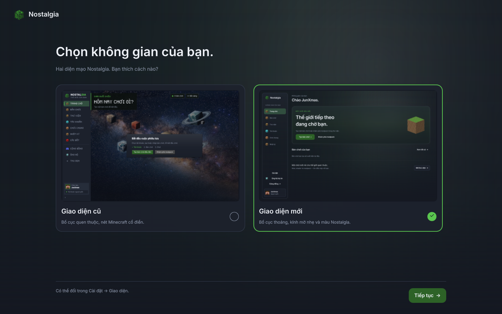
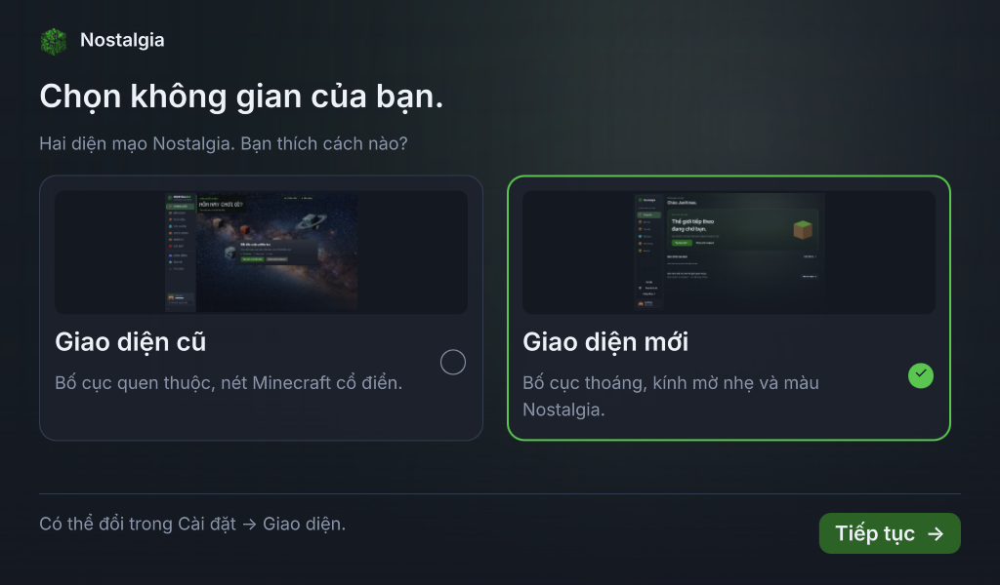

# Preview chọn giao diện ở lần mở đầu

Theo yêu cầu mới nhất: lần mở đầu có hai ô lớn, ảnh giao diện ở trên và chú thích ở dưới.
Chỉ ở runner preview; chưa sửa điểm vào bản phát hành, build bộ cài hoặc push.

## Luồng sử dụng

- Chưa có lựa chọn: mở màn thiết lập trước đăng nhập, không tự chọn sẵn. Bấm ô cũ/mới
  chỉ chọn trong màn này; bấm «Tiếp tục» mới ghi lựa chọn và mở giao diện tương ứng.
- Cũ: dùng `Main.qml` hiện có. Mới: dùng `preview/MinimalPreview.qml`, giữ palette cũ,
  đăng nhập toàn cửa sổ, nền mica ở thư viện và popup đã có.
- Lần mở sau bỏ qua bước chọn và vào đúng diện mạo đã lưu. Giao diện mới chưa có tài
  khoản thì hiện đăng nhập, đã có tài khoản thì vào launcher.
- Cài đặt → Giao diện & ngôn ngữ → «Đổi giao diện…» mở lại hai ô. Có nút giữ diện mạo
  hiện tại; bấm hủy không ghi lựa chọn đang xem thử. Sau đổi/hủy trở về Cài đặt.
- Đổi diện mạo giữ cầu nối và kho dữ liệu: tài khoản, bản chơi, thư mục game và cài đặt
  khác không bị chép hoặc di chuyển. Khóa thao tác đổi khi có tác vụ đang chạy.
- Nếu ghi cấu hình thất bại, giữ màn thiết lập, hiện lỗi và cho thử lại; không báo đã lưu.
  File cấu hình cũ thiếu trường vẫn được đọc; lựa chọn lạ được coi như chưa chọn.

Hai ảnh thẻ là ảnh QQuickView thật của cùng trang chủ với tài khoản ngoại tuyến mẫu
JunXmas, ở 1440×900, lưu trong `qml/assets/interface/`. Không dựng hình minh họa riêng.
Hai ô có kích thước bằng nhau, trạng thái chọn/focus rõ, thao tác Tab/Enter/Space và
nhãn hỗ trợ tiếp cận. Cửa sổ thấp thu nhỏ ảnh và tiêu đề, giữ nút Tiếp tục ở chân màn hình.

## Ảnh Qt thật







Xem [đổi lại trong Cài đặt](preview/minimal/interface-choice.png),
[màn đổi ở 1024×600/chữ 150%](preview/minimal/interface-choice-small-150.png) và
[nút đổi trong Cài đặt](preview/minimal/interface-settings-modern.png).

## Chạy thử

```sh
.venv/bin/python bench/ui_minimal_preview.py --data-dir /tmp/nostalgia-interface-preview
```

Dùng lại cùng `--data-dir` để kiểm tra lần mở tiếp theo giữ lựa chọn.
Không truyền đường dẫn thì runner tạo thư mục tạm mới nên mỗi lần chạy lại đều là lần đầu.
`--payment-demo` vẫn dùng được sau khi chọn giao diện mới; QR không chuyển tiền.

Factory `open_preview(..., ui_setup=True)` dùng luồng thiết lập. Mặc định factory tiếp tục
mở trực tiếp mẫu mới cho các kiểm thử thiết kế độc lập. `app.py` và `Main.qml` chưa đổi;
luồng này chưa được gắn vào launcher đã phát hành hoặc trình cài đặt Windows.

## Kiểm chứng

Kiểm tra Qt thật: chọn cả hai diện mạo, lưu/khôi phục qua cửa sổ mới, ảnh nạp được, hai
ô/nút nằm trong vùng xem ở 1024×600/chữ 100% và 150%, đổi/hủy trong Cài đặt, giữ tài
khoản/bản chơi/file game, giữ lựa chọn khi đổi tùy chọn khác, lỗi ghi cấu hình và retry,
khóa đổi khi tác vụ nội dung chạy. Kiểm tra settings file cũ và giá trị không hợp lệ.

52 kiểm tra liên quan qua trên renderer phần mềm; 16 kiểm tra thiết lập/Cài đặt qua
trên OpenGL/llvmpipe. Ruff toàn kho qua; mypy 399 file qua.

Ảnh chụp trên OpenGL/llvmpipe, không có cảnh báo QML. Chưa đo GPU Windows hoặc chạy
qua trình cài đặt; đây là bản preview để duyệt trước khi tích hợp vào bản phát hành.
